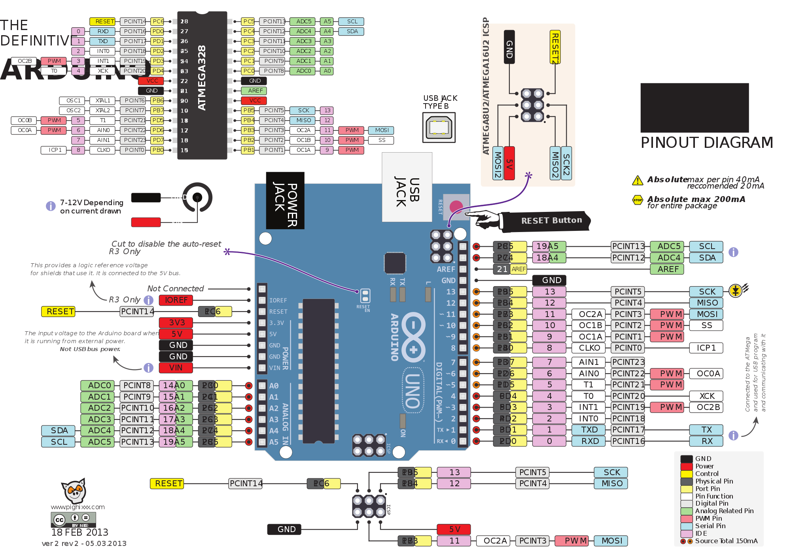

# ATMega328

Arduino Uno is based on the ATmega328 by Atmel. The high-performance Microchip picoPower 8-bit AVR RISC-based microcontroller combines 
- 32KB ISP flash memory with read-while-write capabilities, 
- 1024B EEPROM, 2KB SRAM, 
- 23 general purpose I/O lines, 
- 32 general purpose working registers, 
- three flexible timer/counters with compare modes, 
- internal and external interrupts, 
- serial programmable USART, 
- a byte-oriented 2-wire serial interface, SPI serial port, 
- a 6-channel 10-bit A/D converter (8-channels in TQFP and QFN/MLF packages), 
- programmable watchdog timer with internal oscillator, 
- and five software selectable power saving modes. The device operates between 1.8-5.5 volts.

# Arduino Uno Technical Specification

| **Title**         | **Detail**           | 
| ------------- |:-------------:| 
| Microcontroller     | ATMega328P * bit AVR microcontroller |
| Operating Voltage     | 5V      |
| Recommended Input Voltage | 7 - 122 V    |
| Input Voltage Range| 6 - 20 V |
| DC Current on i/o pins| 40 mA (safe 20 mA)|
| Flash Memory| 32 KB (0.5 KB is used for Bootloader|
| SRAM| 2KB |
| EEPROM| 1 KB |
| Frequency| 16 MHz|

# Arduino Uno Pinout

| **Title** | **Pin Name**| **Detail** |
| ------------- |-------------| -------------|
| Power | Vin, 3.3V, 5V, GND | - **Vin:** Input voltage to Arduino when using an external power source.    -  **5V:** Regulated power supply used to power microcontroller and other components on the board.   - **3.3V:** supply generated by on-board voltage regulator. Maximum current draw is 50mA.  - **GND:** ground pins. |
| Reset | Reset | Making this pin LOW, resets the microcontroller. |
| Analog Pins | A0 - A6 | - Total of 6 analog pins.   - Used to provide analog input in the range of 0-5V. |
| AREF | AREF | Used to provide reference voltage for analog inputs with analogReference() function.|
| IOREF| IOREF | Used to provides the voltage reference with which the microcontroller operates.
| Input/ Output Pins | Digital i/0 pin 0 -13 | - Can be used as input or output pins.   - Pin 13 connected to build in LED.    - Each pin can source or sink current of 20 mA.   - The absolute max current provided (or sank) from all pins together is 200mA.  - Each pin have build in pull-up resistor of 20-50 KOhms which are disconnected by default.  |
| Serial Communication | Rx-0, Tx-1 | Used to receive and transmit TTL serial data. |
| Serial Peripheral Interface (SPI) | SS-10, MOSI-11, MISO-12,SCK-13 | - **MISO (Master In Slave Out):** A line for sending data to the Master device.   - **MOSI (Master Out Slave In):**  The Master line for sending data to peripheral devices.  - **SCK (Serial Clock):** A clock signal generated by the Master device to synchronize data transmission.   -**SS (Slave Select):** determines which device the Master is currently communicating with. |
| I2C | SDA-A4, SC-A5 | - **SCL:** is the clock line which is designed to synchronize data transfers.  - **SDA:** is the line used to transmit data.  - Each device on the I2C bus has a unique address, up to 255 devices can be connected on the same bus.|
| Interrupt | INT0-2, INT2-3 | There are two of interrupt in arduino uno.  - External Interrupt (2,3)   - Pin Change Interrupt which can be activated on any of the pins.|
| PWM | Pins(3,5,6,9,11) | Total of 5 pins provide 8 bit PWM modulation output. |
| Inbuild LED | 13 | To turn on the inbuilt LED. |

