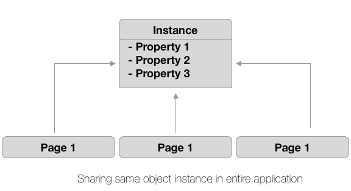

# Singleton Pattern

The single pattern is a way of creating object in such a way that it restrics the instantiatoin of class to a single instance for the life time of application. Singleton pattern can only be applied to refrence type i.e. **class object**



## When to use ?

Singleton pattern can be used when we need to make instance of class that can be accesssible from any part of application and modify the object at any point within the application.

### Implementation

```swift

class MyInsttance {
    static let shared = MyInsttance()
    var count: Int = 0
    
    private init(){}
}

let a = MyInsttance.shared
let b = MyInsttance.shared
let c = MyInsttance.shared

c.count = 3

print(a.count, b.count, c.count) // 3,3,3 all instance will refrence to same value.

```
