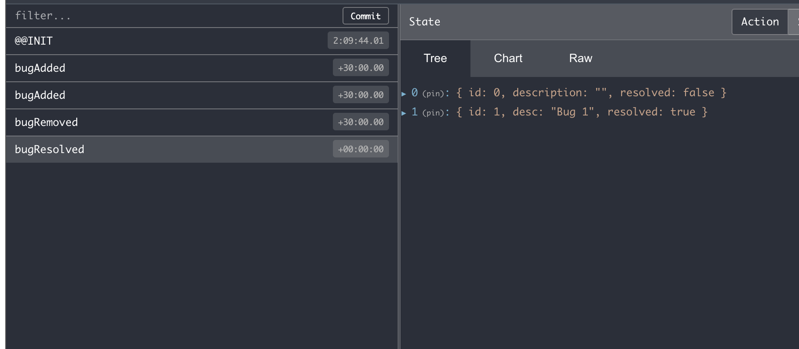

# Redux

## What is Redux ?

- Redux is state management library for  java script  such as react, angular, veu.
    
## When to use ?

- In a application that have complex UI, we need to listen to change in one part of UI and immediately need to change in another part of UI.

- The change in data can be because of network request  or background task or some asynchronous  task.

- Managing data  or state in such app is very complex with out state management solution. Some of  such state management solution are , 
    - Flux (created by Facebook)
    - Redux (inspired by Flux)
    - Mobx

## How redux works ?
   
- In redux instead of scattering the application state in various part of application UI, we store it in a central repository that is a single javascript object called store (a kind of database for front end)

- So different part of ui no longer need to maintain it own state instead they get or store in store.

- If something goes wrong, Redux can show how the change happened and why transparently.

- In short, Redux centralizes our application state and makes data flow transparent and predictable.


## Three Fundamental Principle in Redux

### Actoin

Actions are payloads of information that send data from your application to your store. They are the only source of information for the store. You send them to the store using  **store.dispatch().**

Actions are plain JavaScript objects. Actions must have a type property that indicates the type of action being performed. Types should typically be defined as string constants. Once your app is large enough, you may want to move them into a separate module.


- Action Types filename: **actionTypes.js**

```js
    export const ADD = 'bugAdded'
    export const REMOVED = 'bugRemoved'
    export const RESOLVED = 'bugResolved'
```        

- Action Creator filename: **action.js**

Action creators are exactly that—functions that create actions. In redux, action creators simply return an action

```js
    import * as  actionTypes from './actionTypes';

    export const bugAdded = (text) => {
        return { 
            type: actionTypes.ADD,
            payload: {
                desc: text
                }
            }
    }

    export const bugRemoved = (bugId) => ({
        
            type: actionTypes.REMOVED,
            payload: {
                id: bugId
            }
        
    })

    export const bugResolved = (bugId) => ({
        
        type: actionTypes.RESOLVED,
        payload: {
            id: bugId
        }

    })
```

### Reducer

Reducers specify how the application's state changes in response to actions sent to the store. Remember that actions only describe what happened, but don't describe how the application's state changes.

filename: **reducer.js**

```js

    import * as  actionTypes from './actionTypes';
     
     let lastID = 0

     const initialState = [
    {
        id: lastID,
        description: "",
        resolved: false
    }
]


export default function reducer(state = initialState, action) {

    switch (action.type) {
        case actionTypes.ADD: {
            return [
                ...state,
                {
                    id: ++lastID,
                    desc: action.payload.desc,
                    resolved: false
                }
            ];
        }

        case actionTypes.REMOVED: {
            return state.filter(bug => bug.id !== action.payload.id);
        }

        case actionTypes.RESOLVED: 
            //return state.map( bug =>  bug.id !== action.payload.id ? bug : {...bug, resolved: true})
            return state.map(bug => {
                if (bug.id !== action.payload.id){
                    return bug
                }else{
                    return {...bug, resolved: true}
                }
            })

    

        default: {
            return state
        }
    }

}
     
```

### Store 

The Store is the object that brings action and reducer together. The store has the following responsibilities:

    - Holds application state;
    - Allows access to state via getState();
    - Allows state to be updated via dispatch(action);
    - Registers listeners via subscribe(listener);
    - Handles unregistering of listeners via the function returned by subscribe(listener).

It's important to note that you'll only have a single store in a Redux application. When you want to split your data handling logic, you'll use **reducer composition** instead of many stores.

filename: **store.js**

```js
import {createStore} from 'redux'
import reducer from './reducer'
import {devToolsEnhancer} from 'redux-devtools-extension';
const store = createStore(
    reducer,
    //window.__REDUX_DEVTOOLS_EXTENSION__ && window.__REDUX_DEVTOOLS_EXTENSION__()
    devToolsEnhancer({trace: true})
    );

export default store;
```


### Redux in action

Filename: **index.js**

```js
import store from './store'
import {bugAdded,bugRemoved, bugResolved} from './actions'

//subscribe return function  to unsubscribe from subscription
const unsbuscribed = store.subscribe(() => {
    console.log("store changed ", store.getState());
})

store.dispatch(bugAdded("Bug 1"));
store.dispatch(bugAdded("Bug 2"));
store.dispatch(bugRemoved(2));
store.dispatch( bugResolved(1));
 

```




## webpack-dev-server
    -  Development server that provides live reloading

Installation
```
npm install webpack-dev-server --save-dev
```

Start Dev server
- configuration file: webpack.config.js
```
npm start
```
